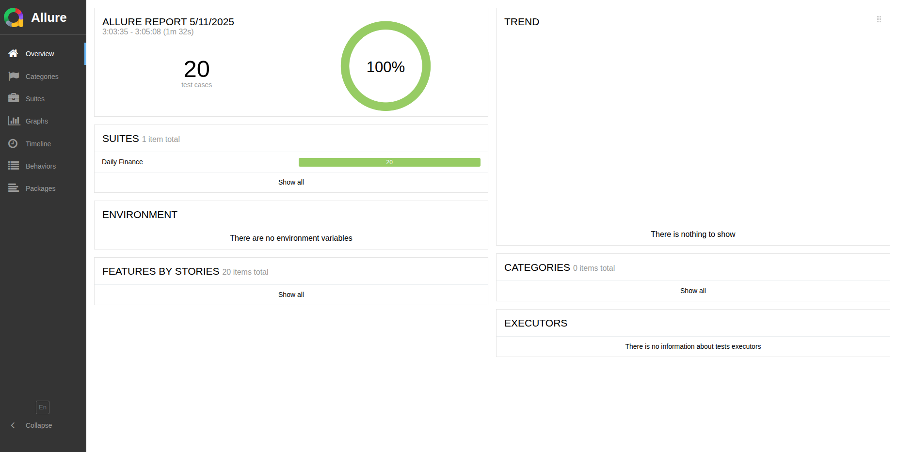
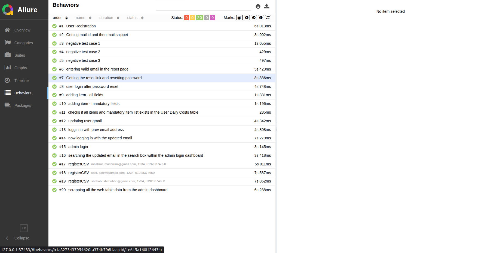

# Daily Finance Test Suite
This is a Selenium-based test automation project using Java, TestNG, and the Page Object Model (POM) design pattern. It automates critical user workflows on [Daily Finance App](https://dailyfinance.roadtocareer.net/), including registration, password reset, profile updates, adding daily costs, search box, admin verification, and data scraping.


##  Features Covered

-  User registration with dynamic Gmail ID
-  Email confirmation via Gmail API
-  Password reset with negative and positive test cases
-  Login with updated credentials
-  Adding cost with all and mandatory fields
-  Profile update with email change
-  Admin login and verification of updated user
-  Registration of users from CSV file
-  Web table data scraping and writing to a text file
-  All tests follow the POM (Page Object Model) structure


##  Tech Stack Used

- **Java** – Programming language
- **Selenium WebDriver** – For browser automation
- **TestNG** – Test framework for structuring and executing tests
- **Gradle** – Project and dependency management
- **Apache Commons CSV** – For reading user data from CSV files
- **REST Assured** – For Gmail API integration and email validation
- **Allure** – For test reporting
- **Git & GitHub** – Version control


##  Setup Instructions

1. **Clone the repository**

   ```bash
      git clone https://github.com/ShababAhmedd/Selenium4Finance.git
      cd daily-finance-automation
   ```

 2. **Open the project in IntelliJ IDEA or your preferred IDE**

   - Choose **Gradle** as the build system
   - Choose **Groovy** as the Gradle DSL
  
3. **Let Gradle resolve all dependencies**
   - Dependencies are managed in `build.gradle`
   - All the necessary dependencies are already downloaded.
     
4. **Required Resource Files**
   Before running the project, create the following files inside `src/test/resources/`:
   - `config.properties` – Holds your Gmail API token. Use `config.sample.properties` as a reference.
   - `users.csv` – Stores user data to be registered. Use `users.sample.json` as a template. Update the file with the user data to be registered. 
   - `localStorage.json` – Used for storing local auth tokens. Use `localStorage.sample.json` as a reference (just create the file empty. The authToken and authTokenData will be written after running the project).
> These files are excluded from version control for security. You must create them manually based on the provided samples.
> These sample files can be found within `sample-resources` which is situated at the root of this project.

5. **Configure Gmail API Token**

   - Open `src/test/resources/config.properties`
   - Add your Gmail access token like this:
     ```base
        g_token = your_generated_gmail_token
     ```

##  Running the Tests
- To execute the entire regression suite, run:
   ```bash
   gradle clean test -PsuiteName="regressionSuite.xml"
   ```

- To run with admin credentials (securely passed via CLI):
   ```bash
   gradle clean test -PsuiteName="regressionSuite.xml" -Pemail="admin@test.com" -Ppassword="admin123"
   ```
- Individual test classes can also be run via CLI or IDE.


## Generating Allure Reports

1. **Run your tests** using Gradle as usual:
2. Generate Allure results:
   If your project is configured with the Allure plugin, run:
   ```bash
   allure generate allure-results --clean -output
   ```
3. Open the report in your browser:
   ```bash
   allure serve allure-results
   ```

## Video Demonstration
### A complete screen recording of the automation test suite execution has been captured:
https://github.com/user-attachments/assets/864968b1-a629-40fe-aabe-fc2f84188646

## Allure Report
- Overview:
  
- Behaviours:
  
  
## Test Case Documentation
[Standard Test Case](https://docs.google.com/spreadsheets/d/1FfP8uhOovGiPdhLYGbcd3hMMJA67-N6T9a2mAqXDDN4/edit?usp=sharing)

##  Project Structure
```
TestNG_project/
├── sample-resources/               # Sample template files (safe to share)
│   ├── config.sample.properties
│   ├── localStorage.sample.json
│   └── users.sample.csv
├── src/
│   └── test/
│       ├── java/
│       │   ├── config/             # Setup, UserModel, RegistrationDataSet
│       │   ├── controller/         # Gmail API controller for email/Snippet
│       │   ├── page/               # Page Object Model (POM) classes
│       │   └── testrunner/         # Test classes for each user/admin flow
|       |   └── utils/              # Utils
│       └── resources/              # Local resources (config.properties, localStorage.json, users.csv were not pushed to repo)
│           ├── config.properties
│           ├── users.json
|           ├── regressionSuite.xml     # TestNG suite configuration
│           ├── localStorage.json
|           ├── users.csv
│           └── webTable.txt
├──              
├── build.gradle                    # Gradle build configuration
└── README.md

```
